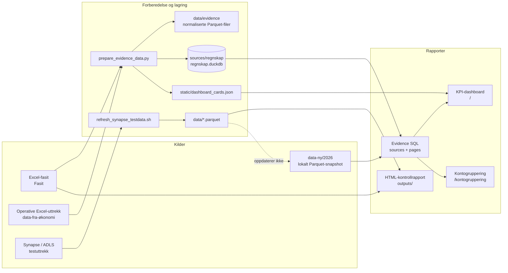
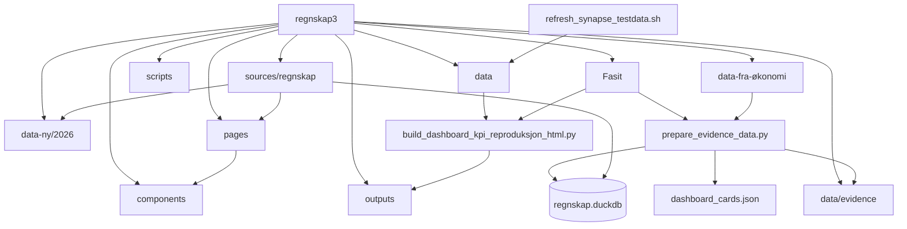
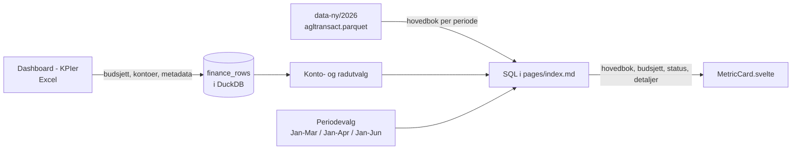
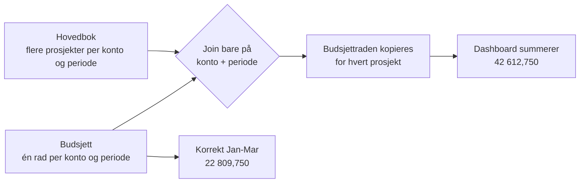
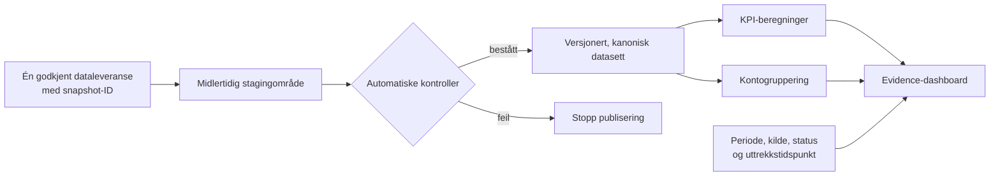

# Prosjektoversikt

Denne siden forklarer hva prosjektet gjør, hvordan filene henger sammen, og hva
som må avklares eller rettes før dashboardet kan brukes som en pålitelig
økonomirapport.

## Kort fortalt

Prosjektet har to brukerflater og tre delvis separate dataløp:

- KPI-dashboardet viser utvalgte nøkkeltall for finansieringene `154301`,
  `154345` og `154322+045101`.
- Kontogrupperingsrapporten beregner tall fra operative Excel-uttrekk for
  `154301` og alle finansieringer, og avstemmer resultatet mot Excel-fasit.
- En separat HTML-rapport kontrollerer om Excel-fasiten kan reproduseres fra
  lokale Synapse-uttrekk.

Kontrollrapporten viser at beregningsgrunnlaget er reprodusert: både budsjett
og hovedbok matcher 172 av 172 kontorader. Det tidligere avviket på 4,5 tusen
kroner på konto 7400 under finansiering `154301` ble lukket med
hovedboksnapshotet fra 14. juli 2026.

Dette betyr ikke at KPI-dashboardet er ferdig kvalitetssikret. Dashboardet bruker
et annet dataløp enn kontrollrapporten. Periodevisningens tidligere duplisering
av budsjettet for `154322+045101` er rettet og dekkes av en regresjonstest.

## Systemkart

Den stiplede forbindelsen er den viktigste arkitekturrisikoen: en vellykket
Synapse-refresh oppdaterer `data/`, mens KPI-dashboardet leser hovedbok fra
`data-ny/2026/agltransact.parquet`.

## Hva de ulike dataløpene beviser

| Dataløp | Formål | Hva det kan brukes til | Begrensning |
| --- | --- | --- | --- |
| Operative Excel-uttrekk til kontogruppering | Beregne hovedbok, budsjett og kontant per konto og gruppe | Avstemme beregnede tall mot forventet Excel-resultat | Er ennå ikke koblet til den kanoniske Synapse-refreshen |
| `data-ny/2026` + Excel til KPI-dashboard | Vise beregnede hovedbokstall mot periodebudsjett | Utforske KPI-er og perioder | Blander kilder og uttrekkstidspunkt; har kjent SQL-feil |
| Synapse-uttrekk i `data/` + Excel til HTML | Reprodusere og avstemme Excel | Dokumentere konto-for-konto-samsvar | Oppdaterer ikke KPI-dashboardet |

## Mappe- og filavhengigheter

### Viktigste filer

| Fil eller mappe | Rolle |
| --- | --- |
| `Fasit/` | Forventede Excel-resultater som bare brukes til avstemming |
| `data-fra-økonomi/` | Operative transaksjons-, budsjett-, kontant- og grupperingsuttrekk |
| `scripts/prepare_evidence_data.py` | Leser Excel og bygger Parquet, DuckDB og kortmetadata |
| `data/evidence/` | Normaliserte Excel-tabeller og råkopier av Excel-ark |
| `sources/regnskap/regnskap.duckdb` | Databasen Evidence bruker |
| `sources/regnskap/*.sql` | Kildespørringer og faste KPI-beregninger |
| `pages/index.md` | Periodeberegninger og sammensetting av KPI-dashboardet |
| `pages/kontogruppering.md` | Datagrunnlag for kontogrupperingsrapporten |
| `components/*.svelte` | Visning, kort, filtre og interaksjon |
| `data/*.parquet` | Synapse-testdata brukt av HTML-avstemmingen |
| `data-ny/2026/*.parquet` | Lokalt snapshot brukt av KPI-dashboardet |
| `outputs/dashboard_kpi_reproduksjon_2026b.html` | Uavhengig Excel/Parquet-kontroll |

## KPI-dataflyt

Beløp vises i NOK 1 000. Hovedbok kommer fra Parquet, mens periodebudsjett og
kontoutvalg kommer fra Excel-tabellen `finance_rows`.

## Finansierings- og perioderegler

| Rapportområde | Hovedbokfilter | Budsjettregel | Excel-periode |
| --- | --- | --- | --- |
| `154301` | `dim_4 = 154301` | Alle `dim_1` unntatt 212 og 761 | Jan-Mar |
| `154345` | `dim_4 = 154345` | `dim_1 = 212` | Jan-Apr |
| `154322+045101` | `dim_4 IN (154322, 045101)` | `dim_1 = 761` | Jan-Mar |
| Testlab `7114` | Samme finansiering og `dim_2 = 7114` | Budsjett mangler | Jan-Mar |

Budsjettmappingen via `dim_1` er en utledet forretningsregel. Den bør godkjennes
og versjoneres av økonomi fordi budsjettdataene ikke har `dim_4`.

## Rettet summeringsfeil

Feilen for `154322+045101` oppstod fordi hovedbok og budsjett hadde forskjellig
detaljnivå da de ble koblet sammen.

Løsningen aggregerer nå hovedboken til én rad per konto før den kobles til
budsjettet. `npm run validate:kpi` kontrollerer at Jan-Mar-budsjettet er
22 809,750, at KPI-totalen matcher detaljgrunnlaget, og at Testlab 7114 har
manglende budsjett.

## Andre forhold som må være tydelige

- `154345` følger valgt rapportperiode. Manglende hovedbok i en valgt periode
  vises som mottatt fra kilden og erstattes ikke med aprilverdien fra Excel.
- Prosjekt `7114` har manglende budsjett. Dette skal vises som manglende, ikke som
  et ordinært nullbudsjett.
- Testlab-kortet viser alle kostnader på konto `5000–7834` for prosjekt `7114`.
- Lønnsandel for `154322+045101` er beregnet som lønn `5000–5999` delt på
  totale kostnader `5000–7834`.
- Dashboardet viser lokalt datasett-ID, dekning og siste transaksjonsdato.
  Faktisk uttrekkstidspunkt og periodestatus mangler fortsatt i kilden og vises
  derfor eksplisitt som ikke dokumentert.
- Konto 7400 under `154301` matcher Excel etter at to operative posteringer på
  2,25 tusen ble med i hovedboksnapshotet fra 14. juli 2026.
- Kontogrupperingen har en duplisert konto `5405`, en mulig `5404/5405`-feil og
  enkelte definerte kontoer som ikke finnes i tallrapportene.

## Ønsket målbilde

Målet er at én refresh oppdaterer det samme validerte datasettet som alle
rapporter leser. Excel kan fortsatt brukes som fasit, men skal ikke være en skjult
del av produksjonsberegningen.

## Konkret arbeidsrekkefølge

### 1. Stopp kjente feil (utført)

1. Rettet budsjettkoblingen for `154322+045101`.
2. Tester at budsjettet er 22 809,750 for Jan-Mar og ikke endres av antall
   hovedboksprosjekter.
3. Tester at de berørte KPI-totalene er lik summen av radene i «Vis grunnlag».
4. Viser manglende budsjett som «Mangler budsjett».

### 2. Avklar KPI-definisjonene (utført 06.08.2026)

1. `154345` følger valgt rapportperiode.
2. Testlab-kortet viser alle kostnader på konto `5000–7834`.
3. Lønnsandelen bruker totale kostnader `5000–7834` som nevner.
4. Budsjettmappingen `212`, `761` og residualregelen for `154301` er godkjent.

### 3. Samle dataløpet

1. Velg enten `data/` eller et nytt versjonert område som kanonisk datakilde.
2. Fjern absolutte stier til `data-ny/2026` fra SQL-filene.
3. La refresh laste til staging, validere dataene og først deretter publisere dem.
4. Lagre snapshot-ID, filhash, radtall, min-/maksperiode og genereringstid.

### 4. Gjør rapporten etterprøvbar

1. Vis datakilde, uttrekkstidspunkt, periode og budsjettversjon i dashboardet.
2. Merk perioder som åpne, foreløpige eller lukket.
3. Sørg for at hvert detaljpanel bruker nøyaktig samme kontoer som KPI-en.
4. Behold konto-for-konto-kontrollen mot Excel som regresjonstest.

## Kommandoer og leveranser

| Kommando | Resultat |
| --- | --- |
| `npm run prepare:data` | Bygger Excel-baserte Parquet-tabeller og DuckDB |
| `npm run validate:task2` | Kontrollerer kontogrupperingsrapporten |
| `npm run refresh:task2` | Klargjør Excel-data, validerer og bygger Evidence |
| `npm run dev:fast` | Starter dashboardet lokalt |
| `bash scripts/refresh_synapse_testdata.sh` | Oppdaterer Synapse-testdata under `data/` |
| `uv run python scripts/build_dashboard_kpi_reproduksjon_html.py` | Bygger HTML-avstemmingen |

`npm run refresh:task2` og Synapse-refresh er forskjellige løp. Ingen av dem
oppdaterer automatisk `data-ny/2026`, som dagens KPI-dashboard leser.
