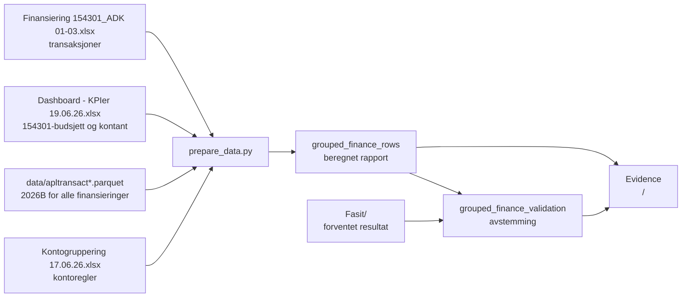

# Oppgave 2 – status for beregnet kontogruppering

**Sist oppdatert:** 29. juli 2026

## Kort konklusjon

Oppgave 2 er flyttet fra en ren fasitvisning til en beregnet rapport.

- Filene under `data-fra-økonomi/` og budsjettfilene under `data/` er operative kilder.
- Filene under `Fasit/` er forventede resultater og brukes bare til avstemming.
- Rapporten har valg for `154301`, `154345`, `154322+045101` og alle
  finansieringer.
- Hvert finansieringsvalg kan vises for januar–mars, januar–april eller
  januar–juni 2026.
- Budsjettversjonen er `2026B` og beløpene vises i NOK 1 000.

Rapporten finnes på `/` når det selvstendige oppgave 2-prosjektet kjører.
Full celle-for-celle-test og tallsporbarhet er dokumentert i
[`oppgave2-tallsporbarhet.md`](oppgave2-tallsporbarhet.md).

## Dataflyt



## Beregningsregler

### Hovedbok

Hovedbok summeres fra det operative transaksjonsuttrekket
`data-fra-økonomi/Finansiering 154301_ADK 01-03.xlsx`.

- Bare periodene `202601`–`202603` tas med.
- Konto kommer fra kolonnen `Konto`.
- Finansiering kommer fra `Dim4`.
- Beløp konverteres fra kroner til tusen kroner.
- `154301` filtreres til `Dim4 = 154301`.
- `alle` summerer alle finansieringer i uttrekket.

### Budsjett

Budsjett hentes fra kontoradene i de operative detaljarkene i
`data-fra-økonomi/Dashboard - KPIer 19.06.26.xlsx`.

- `154301` bruker det operative arket for finansiering `154301`.
- `alle` bruker hele budsjettversjon `2026B` fra `data/apltransact.parquet`
  og `data/apltransactvalue.parquet`.
- Periodebudsjettet beregnes som januar + februar + mars.
- Årsbudsjettet beregnes som summen av alle tolv måneder.

### Kontantregnskap

- `154301` bruker kontantverdiene fra arket for `154301`.
- `alle` summerer kontantverdiene for `154301` og `154322+045101`.
- `154345` tas ikke med i kontantsummen fordi det operative arket gjelder
  januar–april, mens oppgave 2 gjelder januar–mars.

### Kontogrupper

Kontostrukturen kommer fra
`data-fra-økonomi/Kontogruppering 17.06.26.xlsx`.

Den inneholder:

- 3 hovedgrupper;
- 16 kontogrupper;
- 114 unike kontoer.

Konto `5405` er duplisert i kildefilen. Beregningen dedupliserer kontoen slik
at beløpet ikke summeres to ganger. Det må fortsatt avklares med økonomi om den
ene forekomsten egentlig skulle vært konto `5404`.

## Avstemmingsresultat

### Finansiering 154301

Den beregnede rapporten matcher fasit konto-for-konto og på totalnivå.

| Størrelse | Beregnet og fasit |
| --- | ---: |
| Budsjett 01–03 | 80 544,524 |
| Hovedbok | 76 639,477 |
| Avvik | 3 905,047 |
| Årsbudsjett | 322 087,211 |
| Kontant | 70 262,216 |

### Alle finansieringer

Hovedbok, periodebudsjett, avvik, årsbudsjett og kontant matcher fasit.

| Størrelse | Beregnet og fasit |
| --- | ---: |
| Budsjett 01–03 | 116 675,118 |
| Hovedbok | 97 658,486 |
| Avvik | 19 016,632 |
| Årsbudsjett | 467 834,211 |
| Kontant | 82 934,834 |

Det tidligere avviket på 3 millioner er lukket med den operative
budsjettversjonen `2026B`. Konto `6735 – Tildeling kap. 1500, post 21` har
375 tusen per måned fra april til november i Parquet-kilden. Verdiene er ikke
hentet fra fasit.

## Kontodekning

Datagrunnlaget og valideringen dekker alle 114 kontoene fra det operative
grupperingsarket. Kontoer uten hovedbok-, budsjett- eller kontantverdier
beholdes som dokumenterte nullrader i datasettet, men skjules i rapporten og
Excel-eksporten. Filtreringen følger valgt tallvisning: virksomhetsfanen viser
bare rader med synlige virksomhetstall, kontantfanen bare rader med synlige
kontanttall, og månedsfanen bare rader der minst én måned har et synlig beløp.
Beløp som avrundes til `0` i rapportens tusenvisning behandles som null i denne
visningsfiltreringen. Verdier kopieres ikke fra fasit.

For `154301` gjelder dette `5500`, `5930`, `6440`, `6734`, `6735`, `6736`,
`7102`, `7410`, `7791`, `7820` og `7870`. For alle finansieringer har konto
`6735` operativt årsbudsjett, mens de øvrige ti er nullrader.

## Automatiske kontroller

Oppgave 2 kontrollerer nå:

- at alle fire rapportvalgene finnes;
- at hver rapport har én totalrad for driftskostnader;
- at budsjett minus hovedbok er lik avvik;
- at summen av månedsbudsjettet er lik årsbudsjettet;
- at kontantbudsjett minus kontant er lik kontantavviket;
- at manglende kontantbudsjett eller kontantverdi beholdes som tom verdi og
  ikke gir et beregnet kontantavvik;
- kontodekning mot grupperingsdefinisjonen;
- beregnede kontorader mot fasit;
- beregnede totaler mot fasit;
- at `154301` matcher fasit fullstendig.
- alle 12 kombinasjoner av fire finansieringsvalg og tre perioder;
- 2 845 numeriske Excel-celler i de tre finansieringsarkene mot uavhengige
  Parquet-beregninger og avledede formler.

Kjente kildeavvik vises som advarsler. Beregningsfeil stopper valideringen.

## Viktigste filer

| Fil | Rolle |
| --- | --- |
| `kode/scripts/prepare_data.py` | Leser kildene, beregner rapporten og lager avstemmingen |
| `kode/scripts/validate_task2.py` | Kjører obligatoriske oppgave 2-kontroller |
| `kode/tests/test_task2_excel_fasit.py` | Tester relevante Excel-celler mot Parquet |
| `data/evidence/grouped_finance_rows.parquet` | Beregnede rapportlinjer |
| `data/evidence/grouped_finance_fasit_rows.parquet` | Normalisert fasit, bare for kontroll |
| `data/evidence/grouped_finance_validation.parquet` | Resultat av automatiske kontroller |
| `kode/components/KontogrupperingReport.svelte` | Synlig rapport, filtre og Excel-eksport. Nivåfilteret skiller mellom kontogrupper og bare kontoer; kontoer under gruppene åpnes med «Åpne alle grupper» eller per gruppe. |

Hele den definerte kontostrukturen vises også når en finansiering bare har tall
på enkelte kontoer. Nullkontoer skjules ikke. I lukket gruppevisning vises alle
kontogruppene, og «Åpne alle grupper» viser alle 114 kontoer.

Automatiske kontroller vises ikke i sluttbrukergrensesnittet. De genereres og
kjøres fortsatt internt av `npm run validate` og `npm run refresh`, slik at
datakvalitetsfeil fortsatt stopper leveransen.
| `docs/oppgave2-oppdatering.md` | Oppskrift for nye uttrekk |
| `docs/oppgave2-tallsporbarhet.md` | Funksjon og kilde for hver talltype |

## Kommandoer

Bygg data og kjør hele oppgave 2-løpet:

```bash
npm run refresh
```

Kjør bare valideringen etter at dataene er bygget:

```bash
npm run validate:task2
```

Start applikasjonen lokalt:

```bash
npm run dev:fast
```

## Avklaringer og neste steg

1. Avklar om duplikat `5405` egentlig skulle vært `5404`.
2. Bekreft at kontoer uten operative tall skal vises som eksplisitte nullrader.
3. Bekreft at kontantregelen for «alle» skal ekskludere `154345` i
   januar–mars-rapporten.
4. På sikt: erstatt de øvrige operative Excel-uttrekkene med en versjonert,
   kanonisk Synapse-/Parquet-kilde uten å endre beregningsresultatet.

## Godkjenningsstatus

- Teknisk beregning og bygg: bestått.
- `154301` mot fasit: bestått.
- Alle finansieringer mot fasit: bestått.
- Kontodekning: 114 av 114 kontoer i begge rapportene.
- Faglig godkjenning fra økonomi: ikke registrert.
