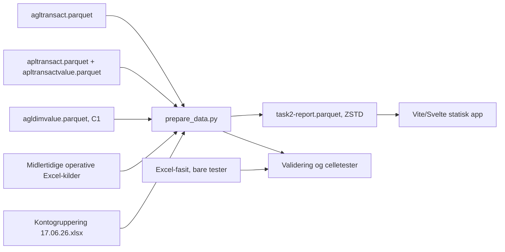

# Oppgave 2: status for kontogruppering

**Sist oppdatert:** 23. august 2026

## Kort konklusjon

Oppgave 2 er en selvstendig statisk Vite/Svelte-app. Den bruker ikke Evidence,
Evidence-komponenter eller en DuckDB-kilde i nettleserbygget.

Rapporten beholder funksjonene fra den tidligere løsningen:

- fire finansieringsvalg;
- fire rapportperioder, inkludert nyeste komplette måned;
- hovedgruppefilter, nivåfilter og kontosøk;
- ekspanderbare kontogrupper;
- virksomhets-, kontant- og månedsvisning;
- Excel-eksport med rapportmetadata.

I tillegg kan brukeren filtrere på 23 seksjoner/kostnadssteder. Valget «Alle
seksjoner» beholder det tidligere totalsynet.

## Seksjon og kostnadssted

Seksjonskoden kommer fra `dim_1` i hovedbok og budsjett. Visningsnavnet hentes
fra dimensjonsregisteret der `attribute_id = C1`. Grensesnittet bruker teksten
«Seksjon / kostnadssted» fordi dette er begrepene brukerne kjenner.

Hovedbok og budsjett kan beregnes per seksjon fra operative Parquet-kilder.
Kontantverdiene kommer fortsatt fra et midlertidig Excel-uttrekk uten
pålitelig seksjonsfordeling. Appen viser derfor tomme kontantfelt og en
kildeforklaring når en seksjon er valgt. Den fordeler ikke totalverdier og
bruker ikke null som erstatning for manglende grunnlag.

## Dataflyt



Den statiske nettleserfilen inneholder 52 608 avledede rapportlinjer og er
omtrent 239 KB med ZSTD-komprimering. Hele produksjonsbygget er omtrent 0,5 MB.
Råtransaksjoner og fasit følger ikke med.

## Validering

Produksjonskontrollen krever:

- alle 16 finansierings-/periodevalg i totalsynet og for hver seksjon;
- alle 118 definerte kontoer i hvert rapportvalg;
- én driftskostnadstotal per valg;
- `budsjett − hovedbok = avvik`;
- tolv månedsbudsjetter som summerer til årsbudsjettet;
- tomme kontantfelt for seksjoner;
- seksjonssummer som avstemmer mot totalsynet;
- uendret samsvar mot den uavhengige Excel-fasiten.

Totalsynet for alle finansieringer i Jan–mar bruker det tidligere avstemte
operative Excel-uttrekket. Seksjonsvisningen bruker Parquet. Det dokumenterte
avviket mellom disse kildene er 1,99 tusen kroner og skjules ikke.

## Viktigste filer

| Fil | Rolle |
| --- | --- |
| `kode/src/App.svelte` | Rapportvisning, filtre og Excel-eksport |
| `kode/src/lib/reportModel.js` | Rapportutvalg, søk og kontohierarki |
| `kode/scripts/prepare_data.py` | Beregning, seksjonsaggregering og statisk Parquet |
| `kode/scripts/validate_task2.py` | Obligatoriske produksjonskontroller |
| `kode/tests/test_task2_excel_fasit.py` | Cellekontroll mot uavhengig fasit |
| `kode/tests/test_task2_grouping_fasit.py` | Konto- og totalkontroll |
| `kode/tests/report_model.test.js` | Seksjonsisolasjon og gruppedrilldown |

## Kommandoer

Kjør fra repositoryroten:

```bash
npm run dev:task2
npm run refresh:task2
npm run build:task2
```

Appen kjører lokalt på `http://localhost:3001/`.

## Neste datasteg

De tre operative Excel-kildene er fortsatt merket `operative-temporary`.
Kontantuttrekket må erstattes med en autoritativ kilde som har seksjonskode før
kontantvisningen kan filtreres på seksjon. Fasit skal fortsatt bare brukes i
tester.
